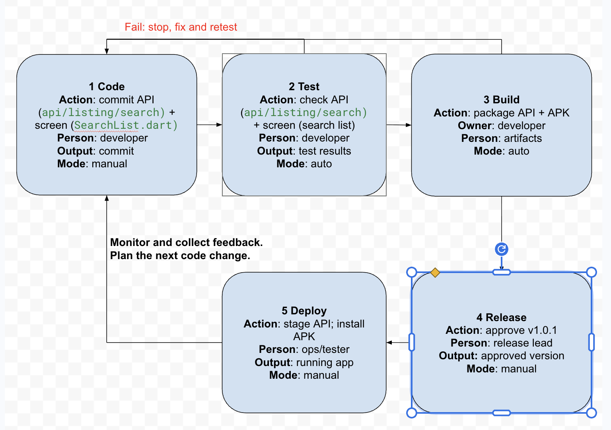

# DevOps Conception Class
- Student: MAO HIENG

## Lesson 2: My CI/CD pipeline
- Project: Friday Beer O'Clock
- Trigger: push to `feature/search-listing`
- Target: Laravel staging server + Testing devices

### Pipeline design
Code -> Test -> Build -> Release -> Deploy
1. Code: commit `api/listing/search` API + flutter screen `SearchRestaurant.dart` | [developer] | [code committed] | [manual]
2. Test: check `api/listing/search` + search screen | [developer] | test results | auto
3. Build: docker image + APK | [developer] | artifacts | auto
4. Release: tag new version `v1.0.1` | manager | approved version | manual
5. Deploy: docker container + installed APK | devops | staging server | manual
### Controls
- On test/build failure: stop release; fix issue; rerun test 
- Release approval by: developer
- After deployment, check: search screen  
- If it fails: stop rollout

Optional drawing: 
